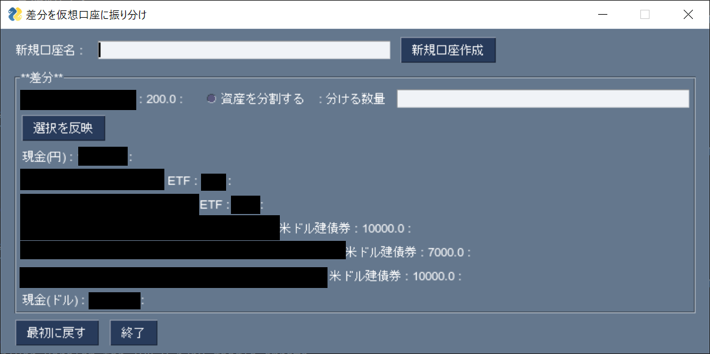

# sbi_vbamgr
## 概要
このプログラムは、SBI証券に登録されている資産を仮想的に複数の口座に分け管理することを可能にするものです。プログラムは以下の順で動きます。
- SBI証券から資産情報を読み込む。
- 仮想的な口座(口座名、[資産名,その資産の数]のリスト)情報が書かれたtomlファイルを読み込む。
- SBI証券の情報と仮想的な口座の資産情報に差がない場合は、仮想的な口座の各資産の評価を表示。
- 差がある場合は、仮想的な口座を編集するウィンドウが立ち上がりますので、編集して下さい。新たな口座を作る、差分資産を口座に振り分ける、複数の口座につけるために差分資産を分割する事ができます。
- 口座情報をtomlファイルに書き込む。

利用には以下のライブラリが必要です。
- beautifulsoup4
- lxml
- Pillow
- PySimpleGUI
- selenium
## 使い方
まずは以下を実行し、仮想口座に資産を振り分けて下さい。
```
$ python3 sbi_vbamgr.py 'sbi-user-name' 'sbi-passwd' ./empty_vba.toml ./my_vba.toml
```
仮想口座を編集する画面が出ます。'empty_vba.toml'には口座情報がないため、SBI口座にあるすべての資産を仮想口座に振り分ける必要があるためです。振り分けた結果は、'my_vba.toml'に出力されます。次回は、'my_vba.toml'を読み込んで下さい。
- 初期画面：

- 空の仮想口座作成後

- 仮想口座に資産を振り分け後

## 完成度
- SBI口座の「円建て株」、「円」、「ドル建て株」、「ドル建て債券」、「ドル」情報は読み込めます。他の資産も読み込めるといいなと思っていますが、テストしていないため可能かは不明です。
- 資産の評価額は円で出します。四捨五入とかはいい加減なので数円のズレがでます。
## 作成動機
- 投資戦略に合わせて資産や余剰資金を管理したかった。[高橋ダン](https://twitter.com/Dan_Takahashi)がそうしましょうと言っていたため。
- 証券口座を複数開きたくなかった。私が死んだ後、家族が解約するのが面倒なため。
- したいことの機能がSBI証券になさそうだった。例えばSBI証券のポートフォリオ機能だと現金を分けて管理できない。
## 免責事項
**本シフト生成ツールの作成者は、本ツールの動作を保証することはなく、結果について責任を一切負いません。**